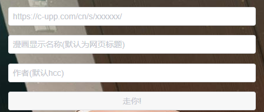

### [Hcomic Creator](https://kas.ystyle.top)

漫画生成器. 输入地址直接生成kindle的mobi漫画格式

[](https://kas.ystyle.top)

### 使用方法
- [下载最新版本的kas.zip](https://github.com/ystyle/kas/releases/latest)
  - linux / osx 系统下载后放添加到PATH， 并自行安装kindlegen
- 解压, 双击`kas.exe`运行, 会自动打开浏览器, 手动打开是: [http://127.0.0.1:1323/](http://127.0.0.1:1323/)

### docker 方式
```shell script
docker run -d --name hcc \
 --restart always \
 -p 1323:1323 \
 -v /mnt/kas/storage:/app/storage \
  ystyle/kas
```